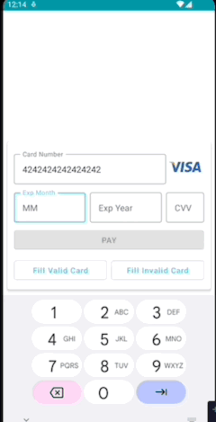

# CKO Payment

## Structure

* `/api`: interface potentially could be used for other modules
* `/data`: repository and contracts
* `/payment`: payment relevant UI components
* `/ui`: shared UI components

## Architecture

* The app runs in a single `MainActivity` with a single `PaymentView`, which shows either of the following 3 views: 
  * `PaymentDetailsView`: A credit card input form for payment making.
  * `ThreeDSView`: A WebView that takes an url as a parameter. Based on the redirect URL it will launch `PaymentResultView`.
  * `PaymentResultView`: A page indicates the payment result depends on the passed parameter.
* `PaymentViewModel` holds the state of the view, for switching between views and the  form field values in `PaymentDetailsView`.
* `PaymentUtils` contains utils methods for validating the input forms in `PaymentDetailsView`, such as validate the credit number, or whether all fields are input correctly.
* `PaymentRepository` is responsibile for making the payment request.
* `PaymentFields` contains common fields for `PaymentDetailsView` and potentially usable for other views.

## Features
* Credit Card input validation
  * card number validation with Luhn algorithm
  * expiry year value validation 
  * expiry year can only be input updated with a valid year, eg, year less than current year is not allowed
  * expiry month value validation 
  * expiry month value check can only be updated with a valid month, eg, larger than 12 is not allowed.
  * cvv value validation 
  * cvv input can't be input more than 3 or 4 digits depends on the card type.
* Payment button is enabled only when all input fields are valid.
* Credit card type displays for Master, VISA & Amex.
* Debug buttons to fill the form with valid/invalid credit card valuse
* Alert dialog shows when the request is not successful

## Frameworks/Libraries

`Jetpack Compose`, `ViewModel`, `Hilt`, `Okhttp3`, `Mockito`, `JUnit`

## Tests
* `PaymentDetailsViewTest`: verifies valid input fields can be updated properly from VM.
* `ThreeDSViewTest` verifies the redirection functionality.
* `PaymentResultViewTest` verifies the text elements on the screen.
* `PaymentUtilsTest` verifies the methods of payment fields update checks and validations.
* `PaymentViewModel` verifies the states update.

## TODOs
* Credit card number formation (with `VisualTransofrmation`)
* `ThreeDSView` can use a better naming.
* Add tests for `PaymentRepository`
* Support auto fill credit card info
